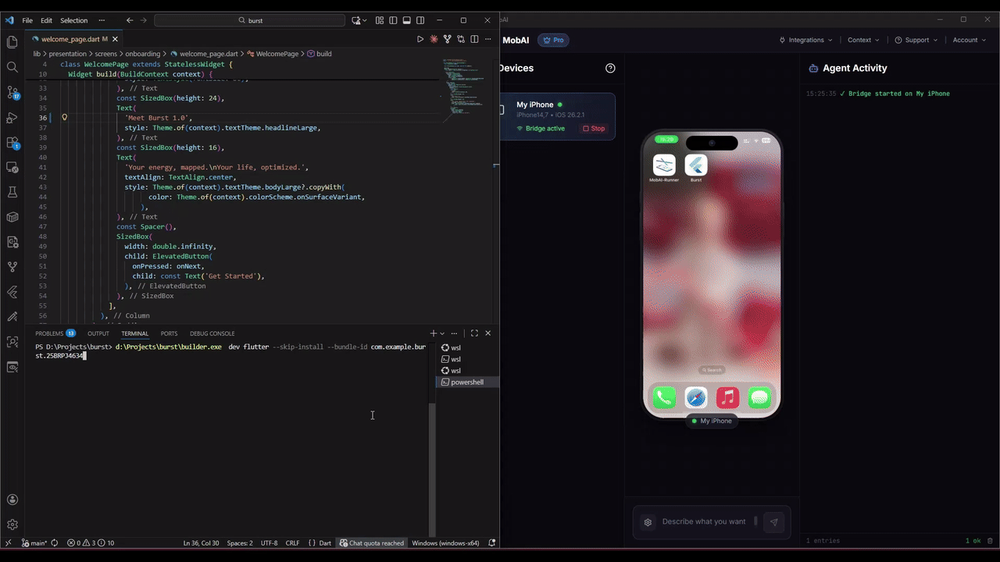

# Builder

Build and develop iOS apps from Windows, Linux, or any platform.

Builder is a CLI tool for iOS development without a Mac. It uses GitHub Actions for remote builds and [MobAI](https://mobai.run) for on-device development.



## Features

- **Build from anywhere**: Build any iOS app (native, Flutter, React Native) via GitHub Actions
- **Try it on a simulator**: Use your build on an iOS simulator from Windows or Linux
- **Flutter & React Native dev tools**: Hot reload on real iOS devices from Windows/Linux
- **Simple setup**: One command to add the workflow to your repo
- **Code signing**: Optional signing with your certificate and provisioning profile
- **Device integration**: Install and run apps via MobAI

## How It Works

```
Your Repository                  GitHub Actions (macOS)
 └─ .github/workflows/            └─ ios-build.yml
     └─ ios-build.yml                 ├─ Checkout code
                                      ├─ Build with Xcode
builder ios build ───────────────────► Upload IPA artifact
     │
     └─ Downloads IPA ◄─────────────── artifact: ipa
```

## Quick Start

### 1. Authenticate with GitHub

```bash
builder auth github
```

### 2. Initialize (in your project directory)

```bash
cd your-ios-project
builder init
```

This detects your GitHub repo, creates the workflow files, and offers to commit, push, and trigger your first build - all interactively.

### 3. Build

```bash
builder ios build
```

The CLI triggers the workflow and downloads the IPA to `./dist/`.

### 4. Try it on a simulator (optional)

```bash
builder ios share
```

Builds the working tree for the iOS simulator and makes that simulator usable
from the [MobAI](https://mobai.run) app, so you can tap through a build without
a Mac. It shows up under CI Devices, stays available while you are using it, and
closes when you release it there or leave it unused (30 minutes by default, use
`--duration` to change).

Needs MobAI Pro and a `MOBAI_API_KEY` repository secret. Create the key in the
MobAI app under Account → API Keys, then:

```bash
gh secret set MOBAI_API_KEY
```

## Supported Frameworks

| Framework | iOS Path | Auto-detected |
|-----------|----------|---------------|
| Native iOS/Swift | `.` (root) | Yes |
| React Native | `ios/` | Yes |
| Expo (ejected) | `ios/` | Yes |
| Flutter | `ios/` | Yes |
| Cordova/Ionic | `platforms/ios/` | Yes |

## Installation

### Windows

Download `builder.exe` from [Releases](https://github.com/MobAI-App/ios-builder/releases) and add to PATH.

### Homebrew (macOS/Linux)

```bash
brew install mobai-app/tap/ios-builder
```

The formula is named `ios-builder`; the command it installs is `builder`.

### macOS/Linux/WSL

```bash
curl -sSL https://raw.githubusercontent.com/MobAI-App/ios-builder/main/install.sh | bash
```

### From Source

```bash
git clone https://github.com/MobAI-App/ios-builder.git
cd ios-builder
go build -o builder ./cmd/builder
```

## Commands

```bash
# Setup
builder auth github           # Authenticate with GitHub
builder init                  # Set up workflow in current repo
builder update                # Update builder to the latest release

# Building
builder ios build             # Trigger build and download IPA to ./dist/
builder ios build --unsigned  # Build without code signing (if signing is configured)

# Simulator (requires MobAI Pro)
builder ios share             # Try the build on a simulator in the MobAI app
builder ios share --duration 1h  # Keep it available longer while unused

# Development (requires MobAI)
builder dev flutter           # Flutter hot reload with file watching
builder dev flutter --no-watch  # Disable automatic file watching
builder dev flutter --no-attach # Print flutter attach command instead of running it
builder dev rn                # React Native hot reload (alias: react-native)
builder dev flutter --skip-install --bundle-id <id>  # Use already installed app
builder dev rn --metro-port 8082  # Use custom Metro port

# Code signing
builder signing csr           # Create a certificate signing request (no Mac needed)
builder signing setup         # Set up code signing secrets
```

## Configuration

`builder.json`:

```json
{
  "project": "MyApp",
  "platform": "ios",
  "github": {
    "owner": "username",
    "repo": "my-ios-app"
  },
  "ios": {
    "path": "ios",
    "scheme": "",
    "signing": true
  },
  "mobai": {
    "url": "http://localhost:8686",
    "device_id": ""
  },
  "flutter": {
    "watch": {
      "dirs": ["lib"],
      "patterns": [".dart"],
      "ignore": [".g.dart", ".freezed.dart"],
      "debounce": 100
    }
  }
}
```

### MobAI Configuration

| Field | Description | Default |
|-------|-------------|---------|
| `mobai.url` | MobAI API URL | `http://localhost:8686` |
| `mobai.device_id` | Preferred device ID (uses first available if empty) | `""` |

**WSL users**: MobAI runs on Windows, so you need to:

1. In MobAI, go to **Integrations → API server** and enable **Allow external connections**
2. Get your Windows hostname and use it with `.local` suffix:

```bash
# Get Windows hostname from WSL
hostname.exe
```

```json
{
  "mobai": {
    "url": "http://YOUR-PC-NAME.local:8686"
  }
}
```

### Flutter File Watcher

| Field | Description | Default |
|-------|-------------|---------|
| `flutter.watch.dirs` | Directories to watch | `["lib"]` |
| `flutter.watch.patterns` | File patterns to match | `[".dart"]` |
| `flutter.watch.ignore` | Patterns to ignore | `[".g.dart", ".freezed.dart"]` |
| `flutter.watch.debounce` | Debounce delay in ms | `100` |

## Code Signing

By default, builds are unsigned. Signed builds need a signing certificate and a
provisioning profile — and despite what many guides claim, **you do not need a
Mac to create either one**. The `.p12` certificate is normally created through
Keychain Access, but Builder does the same thing itself: it generates the
private key and certificate signing request, and assembles the `.p12` from the
certificate Apple issues.

You need a paid [Apple Developer Program](https://developer.apple.com/programs/)
membership — the portal only issues certificates to paid accounts. (Without one,
build unsigned and let [MobAI](https://mobai.run) re-sign on install with a free
Apple ID.)

### 1. Create a certificate signing request

```bash
builder signing csr
```

This asks for your name and email, stores a private key in Builder's config
directory (`~/.config/ios-builder/` — outside the repository, so it can never
end up in a commit or build snapshot), and writes `ios-signing.csr`.

### 2. Create the certificate

1. Go to [Certificates](https://developer.apple.com/account/resources/certificates/add) on the Apple Developer portal
2. Choose **Apple Development** (installs on registered devices) or **Apple Distribution** (App Store/Ad Hoc)
3. Upload `ios-signing.csr` and download the resulting `.cer` file

### 3. Create a provisioning profile

On the portal:

1. **Identifiers** → register an App ID matching your app's bundle identifier
2. **Devices** → register your device's UDID (shown in [MobAI](https://mobai.run) when the device is connected; on Windows, iTunes shows it when you click the serial number on the device page)
3. **Profiles** → create an **iOS App Development** (or Ad Hoc) profile, select your App ID, certificate, and devices, then download the `.mobileprovision` file

### 4. Upload the signing secrets

```bash
builder signing setup --certificate ios_development.cer --profile MyApp.mobileprovision
```

Builder assembles the `.p12` from the `.cer` and the stored key, protects it
with a password you choose, and saves it to `~/.config/ios-builder/signing.p12`
— it's your signing identity, reusable with other tools (Sideloadly, a Mac,
re-running setup). It then uploads the signing material to GitHub Secrets:
- `IOS_CERTIFICATE` - Base64-encoded .p12 file
- `IOS_CERTIFICATE_PASSWORD` - Certificate password
- `IOS_PROVISIONING_PROFILE` - Base64-encoded .mobileprovision file

If you already have a `.p12` (for example, exported from a Mac's Keychain
Access), pass it directly — `builder signing setup --certificate cert.p12` —
and you'll be prompted for its password instead.

Once configured, `builder ios build` will produce signed IPAs. Use `--unsigned` to skip signing.

## Installing the IPA

Use [MobAI](https://mobai.run) to sign and install your IPA directly to your device. MobAI handles code signing automatically and works with both signed and unsigned builds.

## Development on Windows/Linux

Builder supports hot reload for Flutter and React Native on Windows/Linux using [MobAI](https://mobai.run) for iOS device control. This allows you to develop iOS apps without a Mac.

## Flutter Development

### Setup

1. Download and install [MobAI](https://mobai.run/download), then connect your iOS device
2. Build your app:
   ```bash
   builder ios build
   ```
   This creates an IPA in `./dist/`
3. Start development with hot reload:
   ```bash
   builder dev flutter
   ```
   MobAI will guide you through installation. Re-signing requires an iCloud account - we highly recommend creating a new one at [icloud.com](https://icloud.com) instead of using your primary account. If you re-sign, note the new bundle ID (includes team ID suffix, e.g., `com.example.myapp.TEAMID`).

### Subsequent Runs

Once the app is installed, skip the install step:
```bash
builder dev flutter --skip-install --bundle-id com.example.myapp.TEAMID
```

### File Watching

By default, `builder dev flutter` watches for Dart file changes and automatically triggers hot reload. When flutter attach connects, it also sends an initial hot restart to ensure your latest code is running.

- **Automatic hot reload**: Edit a `.dart` file and save - hot reload triggers automatically
- **Generated files ignored**: Files like `.g.dart` and `.freezed.dart` are ignored by default
- **Configurable**: Customize watched directories, patterns, and debounce via `builder.json`

To disable file watching:
```bash
builder dev flutter --no-watch
```

To print the `flutter attach` command instead of running it (useful for IDE integration):
```bash
builder dev flutter --no-attach
```

### When to Rebuild

- **Native code changes** (Swift, Objective-C, Podfile, native dependencies): Run `builder ios build` and reinstall
- **Dart code changes only**: No rebuild needed - file watcher triggers hot reload automatically

If you don't see your recent Dart changes after launching, press `R` in the terminal to perform a hot restart.

### Troubleshooting

**App won't launch / connection error**
- Close the app on your device before running `builder dev flutter`
- Reconnect the device (unplug/replug USB)
- Restart MobAI
- Run `builder mobai ping` to verify connection

**"No devices found" error**
- Ensure MobAI is running and device is connected
- Only physical iOS devices are supported (no simulators)

**Hot reload not working**
- Make sure you're using the correct bundle ID (with team ID suffix)
- Try hot restart with `R` key
- Check that MobAI shows the device as connected

**File watcher not triggering**
- Ensure you're editing files in watched directories (default: `lib/`)
- Check if the file matches watch patterns (default: `.dart`)
- Generated files (`.g.dart`, `.freezed.dart`) are ignored by default
- Try running without `--no-watch` flag

## React Native Development

### Setup

1. Download and install [MobAI](https://mobai.run/download), then connect your iOS device
2. Build your app:
   ```bash
   builder ios build
   ```
3. Start development with hot reload:
   ```bash
   builder dev rn
   ```
   This will:
   - Start Metro bundler if not running
   - Install the IPA on your device (with optional re-signing)
   - Launch the app with Metro URL configured automatically

### Subsequent Runs

Once the app is installed:
```bash
builder dev rn --skip-install --bundle-id com.example.myapp.TEAMID
```

### Custom Metro Port

If port 8081 is in use:
```bash
builder dev rn --metro-port 8082
```

### When to Rebuild

- **Native code changes** (Swift, Objective-C, Podfile, native modules): Run `builder ios build` and reinstall
- **JavaScript changes only**: No rebuild needed - Metro handles it automatically

### Troubleshooting

**Metro not starting**
- Ensure Node.js and React Native CLI are installed
- Try starting Metro manually: `npx react-native start`

**App not connecting to Metro**
- Device must be on the same WiFi network as the computer running Metro
- Check that Metro is running and accessible
- Verify the Metro port is correct (default: 8081)
- On WSL2, ensure MobAI has external connections enabled

**Hot reload not working**
- Shake device or press `d` in Metro terminal to open dev menu
- Enable "Fast Refresh" in dev menu
- Try reloading with `r` in Metro terminal

## Build Limits

GitHub Actions free tier:
- 2,000 minutes/month (macOS uses 10x multiplier = ~200 effective minutes)
- Approximately 15-20 builds per month

## License

[MIT License](LICENSE)
